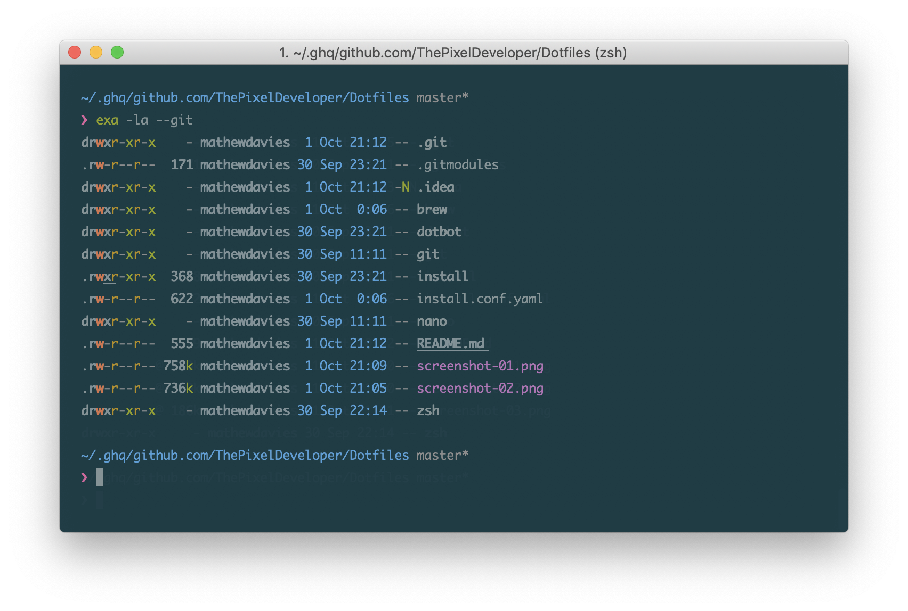

Powered by <a href="https://github.com/sindresorhus/pure">Pure</a> and <a href="https://getantibody.github.io">Antibody</a>. Theme is Solarized Dark with the 12pt Monaco Font at 130% vertical spacing.

Installation provided by <a href="https://github.com/anishathalye/dotbot">dotbot</a>.

